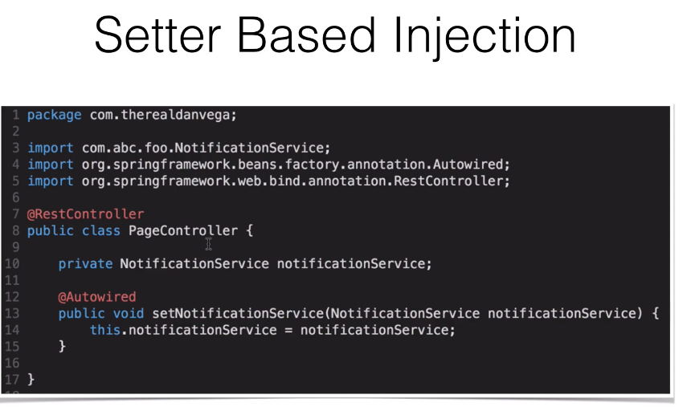

POJO: 

Springs uses aspecting for almost all of its actions. 

ApplicationContext: factory method, every contexts

SpringBoot: cloud native ready but runs in traditional environment

SpringBoot: Embedded Tomcat application server

automatic servlet mappings

Package name equal to group name

## Spring Framework

IOC container

## Spring Boot

Spring Boot Documentation: https://docs.spring.io/spring-boot/docs/current/reference/htmlsingle/#getting-started-introducing-spring-boot

Setup & Configuration is hard

xml

microservices

Pros:

Convention over Configuration:

Spring CLI, entry Point, starter POMs, give us production ready feature.

## Dependency management

All the dependencies that are downloaded from the website are starter projects in maven dependency.


**Why is the Package Name option so critical for a Spring Boot project?**

It is where the Application Class will be created and provides the base for component scanning.


## Embedded Database and Configuration

If you have your own schema and data, make sure you have the following thing in your property sheet, otherwise hibernate would wipe out everything you have set up before.

```java
spring.jpa.hibernate.ddl-auto=none
```

## Spring Data

Reduction of the boilerplate code. Provides ability to swap out datasources much easier. 

Key Components:

1. repository: interface that goes back the traditional repository
2. entity: 

Spring data allows you to have dynamic query generation

Setup of 

## Setting up your rest controller page

```java
@RestController
public class HomeController {
  
  //the annotator here shows that the homepage is mapped
  @RequestMapping("/")
  public String home() {
    return "Hello, Spring Boot!"
  }
}
```


### Starter POMs

Set of convenient dependency descriptors.This can be used to include another pom files so that you don't have to repeate yourself everytime you try to run the code.


## Spring Beans Dependency Injection

Tutorials on spring bean: https://www.baeldung.com/spring-bean

Inversion of Control: https://www.baeldung.com/inversion-control-and-dependency-injection-in-spring

Inversion of control: the class does not create the object. Instead, It let the external programs to handle objects.


## Spring Containers

The Spring container is responsible for instantiating, configuring and assembling objects known as *beans*, as well as managing their lifecycle.




```java
ApplicationContext ctx = SrpingApplciation.run(SpringBEanApplciation.class, args);
String [] beanNames = ctx.getBeanDefinitionNames();
```

## @SpringBootApplication

This is just the another short cut for the three applications

1. **configuration**: if you create beans here, it will be in the application context. Use this on top of any class to declare that this class provides one or more @Bean methods and may be processed by hte Spring container to genreate bean definition and service requests for those ebans at runtime.
2. EnableAutoConfiguration: 
3. ComponentScan: scan the all the components services all within the package

```java
@ComponentScan({"com.therealpackage", "com.foo.package"})

//in your package you should also spring bean
@Service
@Service("userNotificationService") //you can provide your own definiton of service.
```

## Bean

```java
@Bean
public User user() {
	return new User("Danio", "Wang");
}
```

## Externalizaed Configuration


## Application.properties

YAML can be converted to property files. 

```java
//in the property file
pageController.msg=Hello from application.properties
pageController.foo=foo
pageController.bar=bar
// in the java file
@Value("${pageController.msg}")
private String pageControllerMsg;
```

You can also pass from the program lines.

`--pageContoller.msg="foo bar"` This is passed as a command line parameter.

You can also load different versions of beans, based on different profiles.
